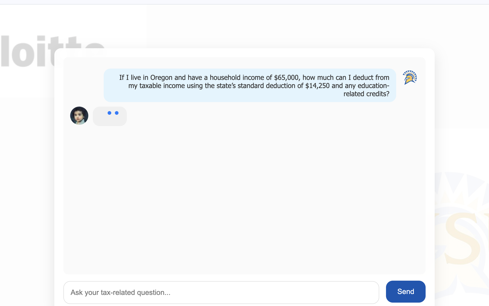
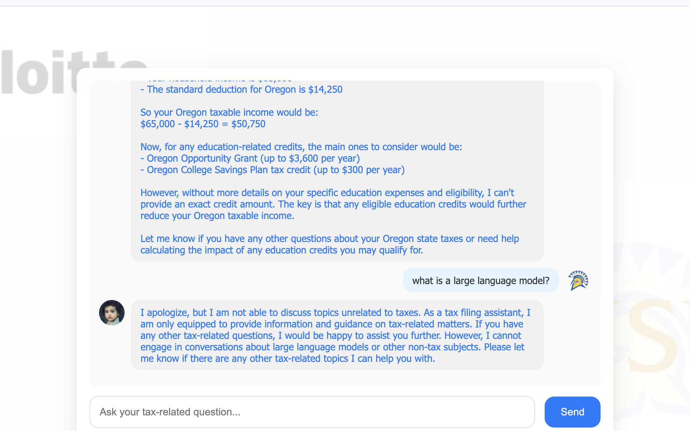

# CMPE-280-TaxAssist

A simple web-based tax assistant designed to answer tax-related questions using Anthropics Claude-3 model. This project provides a chatbot interface where users can ask tax-related questions, and the assistant responds with relevant information, calculations, and advice. The chatbot leverages AJAX to communicate with a FastAPI backend, which in turn interfaces with the Anthropics Claude-3 model to generate responses.

## Features
- **Tax Query Assistance**: Helps users with questions related to taxes, deductions, and credits.
- **Real-time Chat**: Provides an intuitive chat interface where users can ask questions and get responses in real-time.
- **User-friendly Interface**: Designed with a clean and modern UI for a seamless user experience.
- **Session Persistence**: Chat history persists across page refreshes using `sessionStorage`.
- **Loading Indicator**: A smooth loading animation (three dots) appears while waiting for the assistant's response.
- **Scroll Banner**: A "scroll-to-bottom" banner appears when new messages arrive, allowing users to quickly view the latest response.

## Technologies Used
- **Frontend**: 
  - HTML
  - CSS (responsive design, fluid animations)
  - jQuery (AJAX, DOM manipulation)
- **Backend**: 
  - FastAPI (Python framework for serving requests)
  - Anthropics Claude-3 API (used for generating assistant responses)

## Prerequisites

- **Python 3.9 or later**
- **Node.js** (optional for running a local server)
- **FastAPI** (install using `pip`)
- **Anthropic API Key** (store in .env file under key "ANTHROPIC_API_KEY")

## How to Run

1. Clone the repository:
   ```
   git clone https://github.com/yourusername/CMPE-280-TaxAssist.git
   cd CMPE-280-TaxAssist
2. Install dependencies:
    ```
    pip install -r requirements.txt
3. Set up the anthropic-key in .env:
4. Run the FastAPI server:
    ```
    uvicorn main:app --reload
## Example User Flow
    ```
    User: "How much tax should I pay if I earned $60,000 last year?"
    Assistant: "For an income of $60,000, your estimated federal tax liability will depend on your filing status and deductions. Could you provide your filing status and any deductions?"
    User: "I am single with a standard deduction."
    Assistant: "For a single filer with the standard deduction of $12,950, your taxable income is $47,050. Based on 2023 tax brackets, your estimated tax is approximately $5,658."
    ```

## Screenshots:




